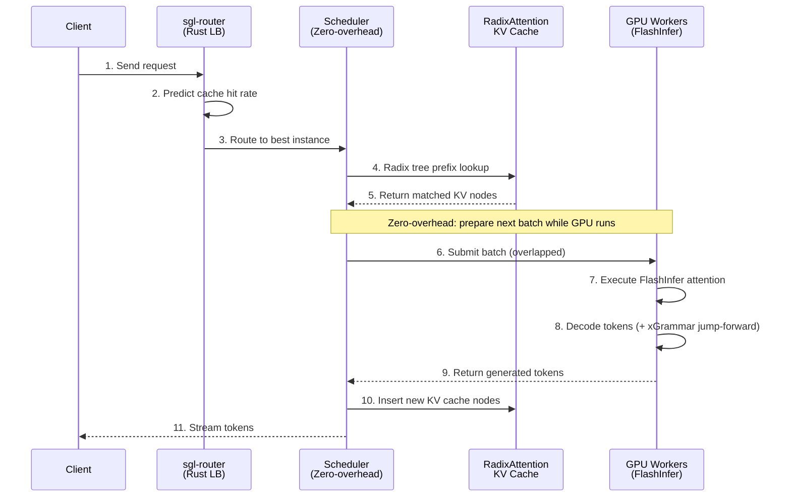
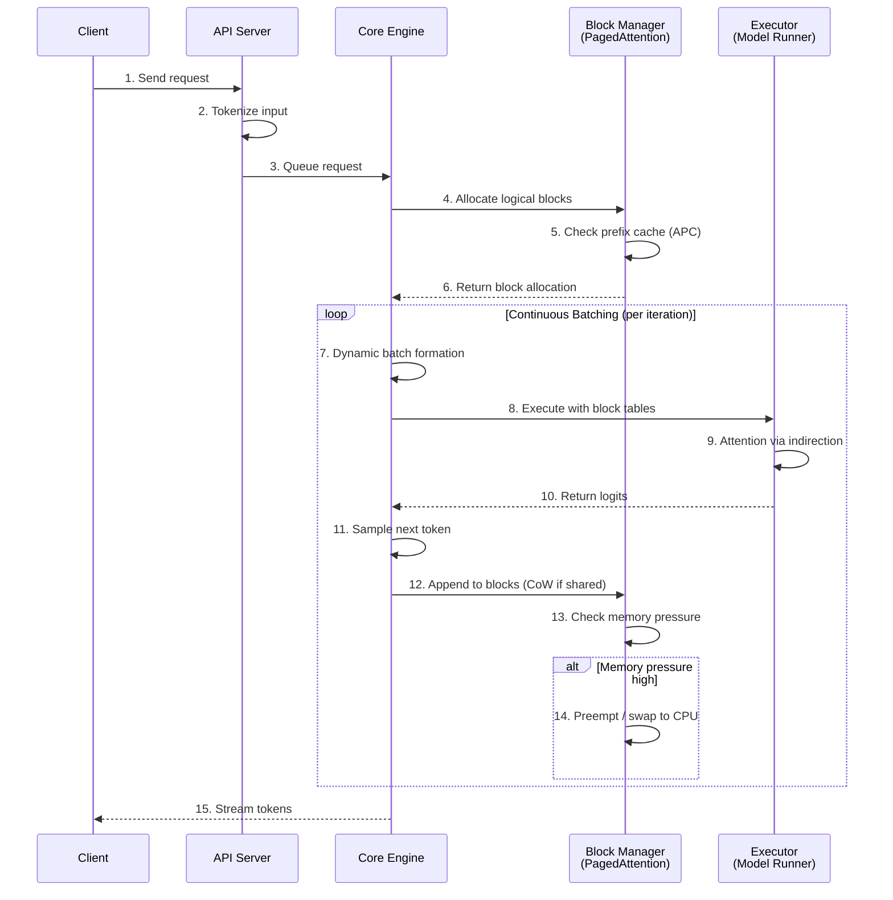

# 1. Overview

Both SGLang and vLLM are high-performance, open-source inference engines for serving large language models. They share a common lineage — both originated from UC Berkeley research labs, and both have rapidly grown into production-grade systems powering some of the world's largest AI deployments. However, they take fundamentally different architectural approaches to solving the same problem: making LLM inference fast, efficient, and cost-effective.

## SGLang — Structured Generation Language

Co-designs a frontend DSL with a backend runtime. Its core innovation is **RadixAttention** — a radix-tree-based KV cache manager that enables automatic, fine-grained prefix sharing across requests. Features a zero-overhead CPU scheduler, cache-aware load balancer, and compressed FSM for structured outputs. Optimized for multi-turn, agentic, and structured workloads.

- **Origin:** LMSYS Org (Lianmin Zheng, Ying Sheng)
- **First release:** Jan 2024
- **GitHub stars:** ~20k+ (as of early 2026)
- **Hosted by:** LMSYS (PyTorch ecosystem)

## vLLM — Virtual Large Language Model

Pioneered **PagedAttention**, an OS-inspired virtual memory system for KV cache management. Focuses on maximum hardware compatibility, broad model support, and enterprise-ready stability. Its plugin-based architecture supports diverse backends, quantization formats, and hardware targets. The most widely-adopted OSS inference engine by install base.

- **Origin:** UC Berkeley (Woosuk Kwon)
- **First release:** Jun 2023
- **GitHub stars:** ~50k+ (as of early 2026)
- **Hosted by:** PyTorch Foundation (via LF AI)

# 2. Architecture Comparison

While both engines aim to maximize GPU utilization for LLM serving, they differ fundamentally in design philosophy. SGLang co-designs the programming interface with the runtime to optimize for structured, multi-step generation workflows. vLLM focuses on being a modular, pluggable inference engine with the broadest possible compatibility surface.

## SGLang Architecture


### SGLang Inference Dataflow



**SGLang Flow Explanation:**

1. **Cache-aware routing (Steps 1-3):** The Rust-based sgl-router predicts which backend instance will have the highest cache hit rate for this request's prefix, achieving up to 3.8x higher hit rates than round-robin.

2. **Radix tree lookup (Steps 4-5):** The scheduler traverses the radix tree to find the longest matching prefix. Shared prefixes (system prompts, few-shot examples) are discovered automatically — no configuration needed.

3. **Zero-overhead scheduling (Step 6):** While the GPU processes the current batch, the CPU concurrently prepares the next batch. This overlap eliminates CPU scheduling stalls that can waste up to 50% of time in other engines.

4. **Execution with jump-forward (Steps 7-8):** FlashInfer kernels execute attention. For structured output, xGrammar's compressed FSM can skip deterministic tokens entirely, bypassing 30-50% of GPU forward passes.

5. **Cache update and streaming (Steps 9-11):** New KV cache is inserted into the radix tree for future reuse. Tokens stream back to the client as they're generated.

## vLLM Architecture (V1 Engine)


### vLLM Inference Dataflow



**vLLM Flow Explanation:**

1. **Request handling (Steps 1-3):** The API server tokenizes the input and queues the request in the core engine. vLLM's OpenAI-compatible API is the most mature in the ecosystem.

2. **Block allocation (Steps 4-6):** The block manager allocates logical blocks for the sequence. Like OS virtual memory, blocks are fixed-size (typically 16 tokens) and mapped to physical GPU memory on demand. Automatic Prefix Caching (APC) checks for reusable prefixes.

3. **Continuous batching loop (Steps 7-12):** Each iteration dynamically forms a batch from all active requests. The GPU executes attention using block table indirection — physical blocks can be non-contiguous. New tokens are appended; if blocks are shared, copy-on-write creates new physical blocks.

4. **Memory management (Steps 13-14):** Under memory pressure, vLLM can preempt lower-priority requests, swapping their KV cache to CPU memory or recomputing later. This flexibility enables handling bursty workloads gracefully.

5. **Streaming (Step 15):** Tokens stream back as they're generated. The iteration loop continues until all sequences complete.

## Core Philosophical Differences

| Dimension             | SGLang                                                                       | vLLM                                                                          |
| --------------------- | ---------------------------------------------------------------------------- | ----------------------------------------------------------------------------- |
| **Design philosophy** | Co-designed frontend language + runtime; treats inference as a _program_     | Modular engine with pluggable backends; treats inference as _request serving_ |
| **KV cache strategy** | RadixAttention — radix tree, automatic prefix discovery, content-addressable | PagedAttention — OS-style virtual memory, fixed-size blocks, block tables     |
| **Scheduler**         | Zero-overhead; overlaps CPU scheduling with GPU compute                      | Dynamic scheduler with preemption support; V1 engine rewrite                  |
| **Structured output** | xGrammar with compressed FSM + jump-forward decoding (up to 10x faster)      | Guided decoding via xGrammar / Outlines integration                           |
| **Load balancing**    | sgl-router: Rust-based, cache-aware routing (1.9x throughput gain)           | llm-d: K8s-native with prefix-aware routing (via LMCache)                     |
| **Codebase size**     | ~4K lines core scheduler (lean, focused)                                     | Larger codebase (broad compatibility layer)                                   |
| **Primary language**  | Python + Rust (router) + CUDA/FlashInfer                                     | Python + C++/CUDA + multi-backend support                                     |

# 3. KV Cache Management: The Core Differentiator

The KV cache is the dominant memory consumer during LLM inference. How each engine manages it is perhaps the single most important architectural decision. Both solve the same problem — eliminate memory waste and enable sharing — but with very different data structures and trade-offs.

## SGLang: RadixAttention (Radix Tree)

SGLang stores KV cache tensors in a **radix tree** (compressed trie) where edges are labeled with variable-length token sequences. This enables automatic, fine-grained prefix sharing across all requests — without any manual configuration.

**How it works:**

1. When a new request arrives, the system traverses the radix tree matching token-by-token
2. Shared prefixes (e.g., system prompts) are found automatically
3. Only divergent suffixes need computation
4. An LRU eviction policy recursively removes leaf nodes when memory is full

```
                    ┌─────────────────────────┐
                    │  "You are a helpful..." │  ← Shared prefix
                    │   (KV cache computed    │    (computed ONCE)
                    │    once, reused)        │
                    └──────────┬──────────────┘
                   ┌───────────┼───────────────┐
                   ▼           ▼               ▼
         ┌──────────────┐ ┌──────────────┐ ┌──────────────┐
         │ "What is     │ │ "What is     │ │ "Explain     │
         │  Python?"    │ │  JavaScript?"│ │  recursion"  │
         └──────┬───────┘ └──────┬───────┘ └──────┬───────┘
                ▼                ▼                ▼
         [output A]       [output B]       [output C]

    Only the unique suffixes need fresh computation!
```

**Key advantage:** Dynamic, content-addressable. The system "learns" caching patterns from actual traffic. Handles branching conversations, few-shot examples, agentic loops, and tree-of-thought workloads automatically.

**Best for:** Multi-turn chat, shared system prompts, RAG with common prefixes, agentic workflows with branching.

## vLLM: PagedAttention (Virtual Memory Paging)

vLLM breaks KV cache into fixed-size **blocks** (typically 16 tokens each) that can be stored non-contiguously in GPU memory. A block table maps logical blocks to physical blocks — directly inspired by OS virtual memory.

**How it works:**

1. Each request maintains a block table (like a page table)
2. Blocks are allocated on demand, not pre-reserved
3. When sequences share a prefix, their block tables point to the same physical blocks
4. Copy-on-write handles divergence
5. Blocks can be swapped to CPU or recomputed under memory pressure

```
    Request A                    Physical GPU Memory
    ┌──────────────┐             ┌─────────────┐
    │ Logical Blk 0│──────────►  │ Phys Blk  7 │  ← shared prefix
    │ Logical Blk 1│──────┐      │ Phys Blk  1 │  ← shared prefix
    │ Logical Blk 2│──┐   │      │ Phys Blk  3 │  ← A's unique tokens
    └──────────────┘  │   │      │ Phys Blk  5 │  ← B's unique tokens
                      │   │      │ (free)      │
    Request B         │   │      │ (free)      │
    ┌──────────────┐  │   │      └─────────────┘
    │ Logical Blk 0│──┼───┘
    │ Logical Blk 1│──┘           Blocks stored
    │ Logical Blk 2│──────────►   NON-CONTIGUOUSLY
    └──────────────┘              (like OS pages)
```

**Key advantage:** Near-zero memory waste (under 4% vs 60-80% in traditional systems). Broad compatibility — works consistently across all hardware backends and model types.

**Best for:** Predictable workloads, batch inference, templated prompts, beam search, broad hardware support.

## Practical Impact

> **Example:** If you have 100 requests sharing a 500-token system prompt:
>
> - **Traditional system:** computes 50,000 tokens
> - **RadixAttention (SGLang):** computes 500 tokens once, automatically reuses 99 times — zero configuration
> - **APC (vLLM):** similar savings, but works best when you can predict and structure your caching patterns
>
> The savings compound dramatically with few-shot prompting, RAG pipelines, and multi-turn conversations.

# 4. Scheduler Design

The CPU scheduler is a surprisingly critical bottleneck in LLM inference. Every iteration requires the CPU to decide which requests to batch, allocate memory, handle prefix matching, and prepare metadata — all while the GPU waits. How each engine handles this overhead is a key performance differentiator.

## SGLang: Zero-Overhead Scheduler

SGLang's scheduler runs **one batch ahead** of the GPU. While the GPU processes the current batch, the CPU concurrently prepares the next batch — overlapping scheduling work with GPU computation.

```
  TRADITIONAL (Sequential):

  ┌──────────┐ ┌────────────────────┐ ┌──────────┐ ┌────────────────────┐
  │ CPU sched│ │    GPU batch 1     │ │ CPU sched│ │    GPU batch 2     │
  └──────────┘ └────────────────────┘ └──────────┘ └────────────────────┘
   GPU idle ↑                          GPU idle ↑


  SGLANG (Overlapped):

  ┌──────────┐
  │CPU prep 1│
  └────┬─────┘
       │  ┌──────────┐
       │  │CPU prep 2│
       │  └────┬─────┘
       │       │  ┌──────────┐
       │       │  │CPU prep 3│
  ┌────┴───────────────┐     │
  │    GPU batch 1     │     │
  └────────────────────┤     │
       ┌───────────────┴─────────────┐
       │       GPU batch 2           │
       └─────────────────────────────┤
              ┌──────────────────────┴───────────┐
              │         GPU batch 3              │
              └──────────────────────────────────┘

  → No GPU idle time! CPU scheduling is fully hidden behind GPU work.
```

Profiling shows unoptimized engines spend **up to 50% of time on CPU overhead**. SGLang's approach reduces this to near-zero, giving a measurable 1.1-1.3x throughput improvement. The impact is most pronounced with small models and large tensor parallelism, where GPU steps are fast and CPU stalls are proportionally expensive.

## vLLM: V1 Engine Scheduler

vLLM's V1 engine (released 2025) represents a comprehensive re-architecture. It uses **dynamic scheduling with preemption support**, allowing it to pause lower-priority requests and offload their KV cache to CPU memory when GPU memory is tight.

The V1 scheduler focuses on **flexibility and correctness** over raw scheduling speed. It supports complex scenarios like guided decoding, speculative decoding, and prefix caching within the same scheduling loop. The trade-off is somewhat higher per-step overhead compared to SGLang's hyper-optimized pipeline.

# 5. Structured Output Generation

Producing guaranteed-valid structured outputs (JSON, XML, SQL) is increasingly critical for production applications. Both engines support constrained decoding, but SGLang has invested particularly heavily in this area.

## SGLang: Compressed FSM + Jump-Forward Decoding

SGLang compiles output schemas (e.g., Pydantic models) into a **compressed Finite State Machine**. When the FSM knows the next token deterministically (like `:` after a JSON key), SGLang skips the GPU entirely and inserts it directly. This "jump-forward" technique can bypass **30-50% of generation steps** for highly structured outputs.

With the xGrammar backend, SGLang achieves up to **10x faster** JSON decoding compared to other open-source solutions.

```
  Schema: { "name": str, "age": int }

  Standard decoding:     GPU → "{" → GPU → '"' → GPU → "n" → GPU → "a" → ...
                         (every token goes through the model)

  Jump-forward:          GPU → "name" → SKIP '{\"' → GPU → value → SKIP '","age":' → GPU → value → SKIP "}"
                         (deterministic tokens inserted directly, no GPU call)

  Result: 30-50% fewer GPU forward passes for structured output
```

## vLLM: Guided Decoding via Plugins

vLLM supports constrained decoding through its pluggable architecture, integrating xGrammar and Outlines as backends. The approach applies token-level masks to restrict the model's vocabulary at each step. While effective, it runs as an overlay on the standard pipeline rather than being deeply integrated into the scheduling and caching system.

# 6. Distributed Serving & Multi-GPU

Both engines support tensor parallelism, pipeline parallelism, and data parallelism. The key differences lie in load balancing and cache-aware routing at scale.

| Strategy                   | SGLang                                                                            | vLLM                                                                           |
| -------------------------- | --------------------------------------------------------------------------------- | ------------------------------------------------------------------------------ |
| **Tensor Parallelism**     | Full support; optimized for high-TP with zero-overhead scheduling                 | Full support; zero-redundancy memory allocation                                |
| **Data Parallelism**       | DP attention for DeepSeek models (1.9x decode throughput); sgl-router coordinates | Standard DP; llm-d project for K8s-native scaling                              |
| **Expert Parallelism**     | Native EP for MoE models; large-scale EP on 96+ H100 GPUs demonstrated            | MoE support with expert-level load balancing                                   |
| **Pipeline Parallelism**   | Supported for multi-node deployments                                              | Multi-node scaling via PP across servers                                       |
| **Prefill-Decode Disagg.** | Native support                                                                    | Via llm-d project (Red Hat, Google, IBM, NVIDIA)                               |
| **Load Balancing**         | sgl-router: Rust, predicts cache hit rates (3.8x higher hit rate)                 | llm-d: K8s Inference Gateway + LMCache                                         |
| **Hardware Support**       | NVIDIA (GB200/H100/A100), AMD (MI355/MI300), Intel Xeon, TPUs, Ascend NPUs        | NVIDIA (all from V100+), AMD MI, TPU, AWS Trainium/Inferentia, Intel Gaudi/XPU |

> **Hardware breadth edge → vLLM.** vLLM's plugin architecture gives it broader hardware support, including AWS Neuron and Intel Gaudi — important for organizations committed to non-NVIDIA stacks. SGLang leads on cutting-edge NVIDIA hardware optimization (GB200, large-scale EP) and has been closing the gap.

# 7. Performance Benchmarks

Performance comparisons should be interpreted carefully — results depend heavily on model size, hardware, workload type, batch size, and engine version. Both projects iterate rapidly. That said, independent benchmarks from 2025 paint a consistent picture.

## Throughput: Llama 3.1 8B on H100 (ShareGPT workload)

_Source: AIMultiple Research — 1,000 ShareGPT prompts, bfloat16, 0.8 GPU memory utilization_

```
  SGLang    ████████████████████████████████████████████████████  16,215 tok/s
  LMDeploy  ███████████████████████████████████████████████████▉  16,132 tok/s
  vLLM*     ████████████████████████████████████████             12,553 tok/s

  * vLLM with FlashInfer backend (same kernels as SGLang)
  → 29% gap persists even with identical compute kernels
  → Difference stems from orchestration overhead, not kernel performance
```

## Key Benchmark Findings

| Metric                           | Value    | Note                                                             |
| -------------------------------- | -------- | ---------------------------------------------------------------- |
| **SGLang throughput advantage**  | **29%**  | H100, batch inference, vs vLLM with FlashInfer                   |
| **vLLM time-to-first-token**     | **Best** | Fastest TTFT across all concurrency levels in GPT-OSS-120B tests |
| **sgl-router cache hit rate**    | **3.8x** | vs round-robin load balancing                                    |
| **Stripe's vLLM cost reduction** | **73%**  | 50M daily API calls on 1/3 the GPU fleet                         |

## Nuanced Performance Picture

| Metric                      | SGLang Wins                                     | vLLM Wins                                                    |
| --------------------------- | ----------------------------------------------- | ------------------------------------------------------------ |
| Batch throughput (tok/s)    | Consistently higher by 15-30% on H100           | —                                                            |
| Time to First Token (TTFT)  | 79ms mean (with cache hits)                     | Fastest across all concurrency in some benchmarks            |
| Inter-Token Latency         | Most stable (4-21ms regardless of load)         | —                                                            |
| High concurrency (100+ req) | —                                               | Highest throughput at 100 concurrent requests (GPT-OSS-120B) |
| Multi-turn conversations    | Clear advantage (RadixAttention prefix sharing) | —                                                            |
| Structured output (JSON)    | Up to 10x faster with xGrammar                  | —                                                            |
| Non-NVIDIA hardware         | —                                               | Broader support and testing                                  |
| DeepSeek models             | Day-0 support, DP attention (1.9x decode)       | Full support with MLA optimizations                          |

# 8. Industry Adoption Survey

Both engines have achieved remarkable production adoption, but with distinct patterns. vLLM has the larger install base and broader enterprise footprint. SGLang has surged in adoption for frontier-model serving and post-training workflows.

## SGLang Notable Adopters

**400,000+ GPUs** running SGLang worldwide. Trillions of tokens generated daily.

| Category             | Companies                                                         |
| -------------------- | ----------------------------------------------------------------- |
| **Flagship**         | **xAI** (serves Grok 3), **Microsoft Azure** (DeepSeek R1 on AMD) |
| **Cloud Providers**  | Oracle Cloud, Google Cloud, AWS, Nebius, DataCrunch, Voltage Park |
| **AI Companies**     | Cursor, NVIDIA, AMD, Intel, LinkedIn, Baseten, RunPod, Novita     |
| **Academia**         | Stanford, UC Berkeley, UCLA, MIT, U of Washington, Tsinghua       |
| **RL/Post-Training** | De facto backbone for verl, AReaL, Miles, slime, Tunix            |

Funded by a16z's OSS AI Grant. Part of PyTorch ecosystem since March 2025.

## vLLM Notable Adopters

**~50K+ GitHub stars**, largest OSS inference community. 100+ model architectures.

| Category            | Companies                                                     |
| ------------------- | ------------------------------------------------------------- |
| **Flagship**        | **Meta**, **Amazon** (Rufus), **Stripe** (73% cost reduction) |
| **AI Companies**    | Mistral AI, Cohere, Anyscale, Roblox                          |
| **Enterprise**      | **IBM / Red Hat** (AI Inference Server), NVIDIA, AMD, Intel   |
| **Cloud Providers** | Google Cloud, AWS, Azure                                      |
| **K8s Ecosystem**   | llm-d project (Red Hat, Google Cloud, IBM, NVIDIA, CoreWeave) |

Red Hat acquired Neural Magic and launched commercial AI Inference Server based on vLLM.

## Adoption Pattern Comparison

| Dimension              | SGLang                                 | vLLM                                                   |
| ---------------------- | -------------------------------------- | ------------------------------------------------------ |
| **Primary adopters**   | Frontier AI labs, GPU cloud providers  | Enterprise teams, platform companies                   |
| **Enterprise product** | None (community-driven)                | Red Hat AI Inference Server                            |
| **Foundation backing** | PyTorch ecosystem; LMSYS non-profit    | PyTorch Foundation; Red Hat (Neural Magic)             |
| **Post-training / RL** | De facto standard (verl, AReaL, Miles) | Growing adoption                                       |
| **Cloud integrations** | Available on most GPU clouds           | Deeper integrations (SageMaker, RHEL AI, OpenShift AI) |
| **Community velocity** | 300+ contributors, rapid iteration     | 15+ full-time, 20+ orgs, largest community             |

# 9. TL;DR Decision Guide

There is no universally "better" engine — the right choice depends on your specific workload, team capabilities, hardware, and priorities.

## Choose SGLang when...

1. **Multi-turn conversations with shared context** — Chatbots, coding assistants, tutoring systems. RadixAttention automatically shares KV cache across conversational turns — zero configuration needed.

2. **Structured output generation (JSON, XML, SQL)** — Compressed FSM + jump-forward decoding can skip 30-50% of generation steps. Up to 10x faster for JSON tasks.

3. **Agentic / tree-of-thought / reasoning workloads** — Branching execution paths are a natural fit for the radix tree cache. The frontend DSL makes complex LLM programs composable.

4. **Maximum throughput on NVIDIA H100/GB200** — Independent benchmarks consistently show 15-30% throughput advantage on Hopper-class GPUs.

5. **RL post-training / rollout generation** — De facto backbone for RL frameworks (verl, AReaL, Miles). Native integrations for training workflows.

## Choose vLLM when...

1. **Broad hardware compatibility is critical** — Need AMD, Intel Gaudi, AWS Trainium, TPU, and NVIDIA? vLLM has the widest hardware backend support.

2. **Enterprise-grade stability & support** — Red Hat AI Inference Server provides a commercial, hardened distribution. Largest community, most tutorials, most battle-tested in Fortune 500.

3. **Drop-in OpenAI API replacement** — vLLM's OpenAI-compatible API is the most mature. Minimal friction for migrations.

4. **K8s-native distributed deployment** — The llm-d project provides production-grade K8s orchestration with disaggregated serving.

5. **Batch inference with predictable patterns** — Templated prompts, batch content generation, single-round Q&A. PagedAttention excels when caching patterns are consistent.

## Either works well for...

- **Standard chat serving, RAG pipelines, general-purpose LLM APIs** — Both are production-grade. Performance differences are narrowing with each release.
- **DeepSeek, Llama, Qwen, Mistral model families** — Both have day-0 support for major releases. Both support FP8, INT4, AWQ, GPTQ quantization.

## Quick Decision Flowchart

```
  START
    │
    ├─ Multi-turn / agentic / structured output heavy?
    │   └─ YES → SGLang
    │
    ├─ Need non-NVIDIA hardware (Trainium, Gaudi)?
    │   └─ YES → vLLM
    │
    ├─ Need enterprise support / Red Hat ecosystem?
    │   └─ YES → vLLM
    │
    ├─ Max throughput on H100/GB200?
    │   └─ YES → SGLang
    │
    ├─ RL / post-training rollouts?
    │   └─ YES → SGLang
    │
    ├─ K8s-native with disaggregated serving?
    │   └─ YES → vLLM (llm-d)
    │
    └─ Standard chat / RAG / batch?
        └─ EITHER — benchmark YOUR workload
```

> **Final advice:** Always benchmark with YOUR workload on YOUR hardware before committing. Both projects release new versions frequently with significant performance improvements. The "best" engine today may not be the best in 3 months. Consider maintaining the ability to switch — both support OpenAI-compatible APIs, making migration relatively straightforward.

---
_Research compiled from: official documentation, GitHub repos, academic papers (arXiv:2312.07104, arXiv:2309.06180), LMSYS blog, vLLM blog, independent benchmarks (AIMultiple, Clarifai), PyTorch Foundation announcements, Red Hat engineering blogs, and community reports. All data as of January 2026._
